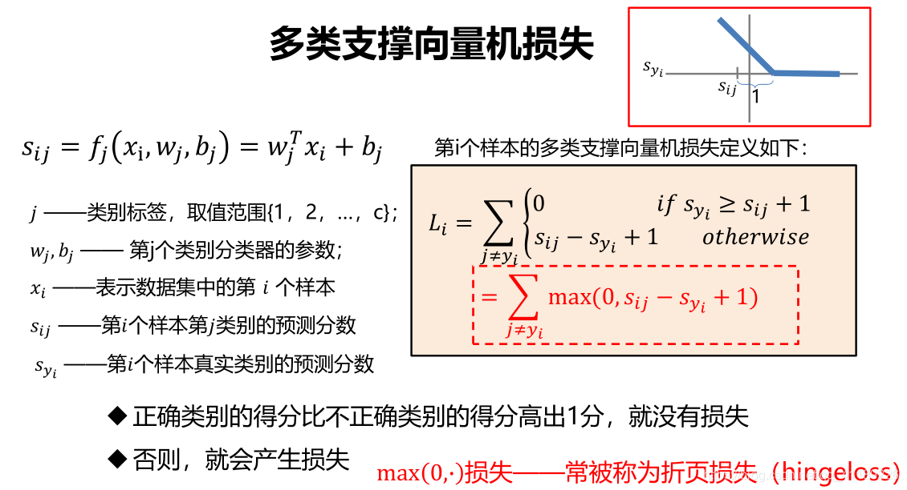

# 2024.3.14
## L1 distance
L1距离 $d_1(I_1,I_2) = \sum_{p}(I_1^P -  I_2^P)^2 $

可以用于比较两个图片的差别(nXn)矩阵A和一个(nXn)矩阵B，相减然后将矩阵中元素相加

以下是利用L1距离计算图片相似性代码

## L2 distance （欧氏距离）
L1距离 $d_1(I_1,I_2) = \sqrt{\sum_{p}(I_1^P -  I_2^P)^2} $

## Loss function 
### 多类支持向量机损失

 
## L1 L2 正则化
正则化是机器学习和统计建模中用于防止过度拟合并提高模型泛化能力的技术。

正则化在训练过程中对模型引入额外的约束或惩罚，旨在控制模型的复杂性并避免过度依赖训练数据中的特定特征或模式
```
L1 regularization = λ * Σ|wi|
wi代表各个模型系数，并对所有系数求和
```
```
L2 regularization = λ * Σ(wi^2)
对所有系数求和，并对系数的平方进行求和
```
## 批量归一化
是的每一层输入的分类类似，可以帮助加速神经网络的收敛